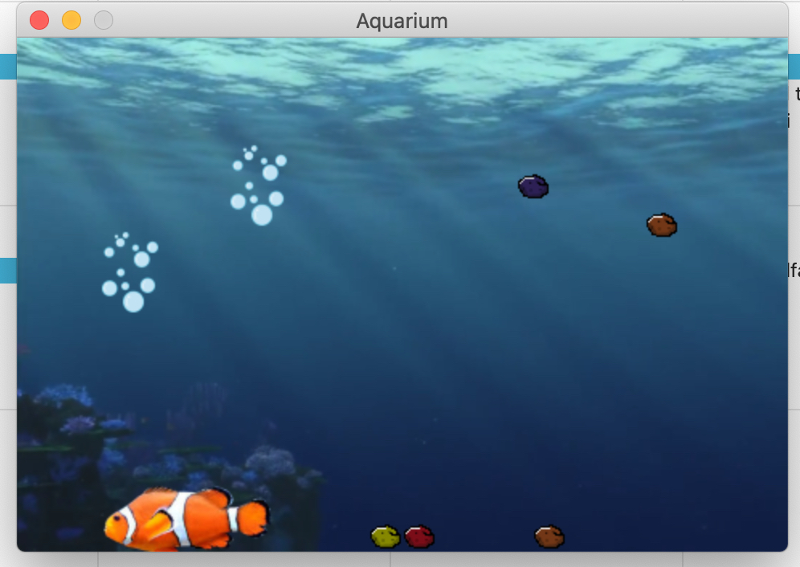

# Your Own pet for the RasperyPi


## About

This Project is almost older than me. It was a fun little project, that I've done for school
It is simply a cute little Nemo swimming around your raspberry. 
  - Right click to Pet
  - left click to interact.

Dont expect much. I wasn't well experienced in Python at that time. :/


## Requirements:

```bash
pip install pygame
```
